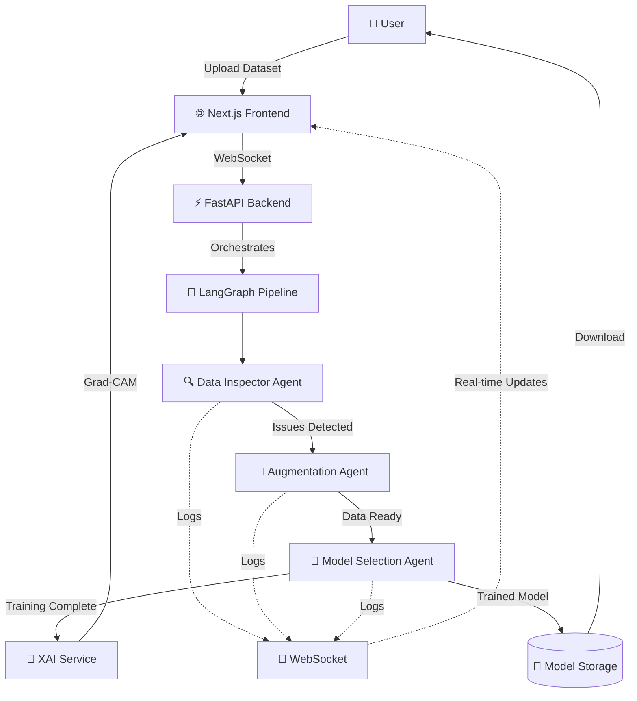

# 🏥 AutoMed AI

<div align="center">


**LangGraph-powered AI agentic workflow for autonomous ML pipelines. Specialized agents collaborate to inspect datasets, apply augmentation, train models, and generate XAI visualizations.**

[Features](#-features) • [Architecture](#-architecture) • [Quick Start](#-quick-start) • [Usage](#-usage) • [API](#-api-reference)

</div>

---

## 📋 Table of Contents

- [Overview](#-overview)
- [Features](#-features)
- [Architecture](#-architecture)
- [Tech Stack](#-tech-stack)
- [Quick Start](#-quick-start)
- [Usage Guide](#-usage-guide)
- [Agent Workflow](#-agent-workflow)
- [API Reference](#-api-reference)
- [Project Structure](#-project-structure)
- [Troubleshooting](#-troubleshooting)

---

## 🎯 Overview

**AutoMed AI** is an end-to-end AI platform that automates the entire machine learning pipeline for medical image classification. Built with **LangGraph** multi-agent orchestration, it intelligently handles dataset inspection, quality enhancement, model training, and explainable AI—all without manual intervention.

### 🌟 What Makes It Special?

- 🤖 **Fully Autonomous**: AI agents make intelligent decisions at every step
- 🔍 **Smart Quality Control**: Automatically detects and fixes dataset issues
- 🎨 **Intelligent Augmentation**: GAN-based synthetic data generation + traditional techniques
- 🧠 **Explainable AI**: Grad-CAM visualizations show what the model "sees"
- 📊 **Real-time Monitoring**: Live agent activity logs streamed via WebSocket
- 🎨 **Premium UI**: Modern, responsive interface with glassmorphism and smooth animations

---

## ✨ Features

### 🔬 Data Inspector Agent
- ✅ **Quality Analysis**: Detects blurry, low-quality images
- 📊 **Class Balance Check**: Identifies imbalanced datasets
- 🔢 **Quantity Assessment**: Flags insufficient training data
- 🗑️ **Cleaning**: Removes duplicates and corrupted images
- 📈 **Noise Detection**: Analyzes image noise levels

### 🎨 Augmentation Agent
- 🖼️ **Traditional Augmentation**: Flips, rotations, crops, color jittering
- 🤖 **GAN Synthesis**: Generates synthetic medical images for minority classes
- 🌟 **Quality Enhancement**: Diffusion-based image improvement for blurry samples
- ⚖️ **Smart Balancing**: Automatically balances class distributions

### 🧠 Model Selection & Training Agent
- 🎯 **Intelligent Selection**: Chooses optimal architecture (ResNet, EfficientNet, DenseNet)
- 📚 **Transfer Learning**: Leverages pre-trained ImageNet weights
- 🔄 **Adaptive Training**: Monitors validation metrics and adjusts
- 💾 **Auto-Save**: Saves best models with metadata
- 📝 **Class Mapping**: Stores class names for interpretable predictions

### 🔍 XAI (Explainable AI) Service
- 🎨 **Grad-CAM Heatmaps**: Visual explanations of model decisions
- 📊 **Confidence Scores**: Prediction probabilities for each class
- 💬 **Natural Language Explanations**: Human-readable reasoning
- 🖼️ **Overlay Visualization**: Heatmaps overlaid on original images

---

## 🏗️ Architecture



### 🔄 Agent Workflow

1. **📤 Dataset Upload** → User provides medical image dataset path
2. **🔍 Data Inspection** → Agent analyzes quality, balance, and quantity
3. **⚠️ Issue Detection** → Identifies problems (blur, imbalance, duplicates)
4. **🎨 Smart Augmentation** → Applies appropriate fixes (GAN, traditional, cleaning)
5. **🧠 Model Selection** → Chooses best architecture based on dataset characteristics
6. **🏋️ Training** → Trains model with early stopping and validation monitoring
7. **💾 Model Export** → Saves best model with metadata
8. **🔬 XAI Testing** → Generates Grad-CAM explanations for predictions

---

## 🛠️ Tech Stack

### Backend
- **🐍 Python 3.10+** - Core language
- **⚡ FastAPI** - High-performance async API framework
- **🔄 LangGraph** - Multi-agent workflow orchestration
- **🔥 PyTorch** - Deep learning framework
- **🖼️ torchvision** - Pre-trained models and transforms
- **📊 NumPy & OpenCV** - Image processing
- **🎨 Albumentations** - Advanced augmentation library

### Frontend
- **⚛️ Next.js 16** - React framework with Turbopack
- **🎨 Tailwind CSS v4** - Utility-first styling
- **📡 WebSocket** - Real-time communication
- **📘 TypeScript** - Type-safe development

---

## 🚀 Quick Start

### Prerequisites

```bash
✅ Python 3.10 or higher
✅ Node.js 18 or higher
✅ UV package manager (recommended) or pip
✅ CUDA-compatible GPU (optional, for faster training)
```

### 1️⃣ Clone Repository

```bash
git clone <repository-url>
cd Prototype
```

### 2️⃣ Backend Setup

```bash
# Install Python dependencies
uv sync
# OR using pip
pip install -r requirements.txt

# Start FastAPI server
python -m uvicorn backend.api:app --reload --port 8000
```

✅ Backend running at `http://localhost:8000`

### 3️⃣ Frontend Setup

```bash
# Navigate to frontend
cd frontend

# Install dependencies
npm install

# Start development server
npm run dev
```

✅ Frontend running at `http://localhost:3000`

---

## 📖 Usage Guide

### 🎯 Training a New Model

1. **📂 Prepare Your Dataset**
   ```
   your_dataset/
   ├── train/
   │   ├── class0/
   │   │   ├── image1.jpg
   │   │   └── image2.jpg
   │   └── class1/
   │       ├── image1.jpg
   │       └── image2.jpg
   └── test/
       ├── class0/
       └── class1/
   ```

2. **🌐 Open the Web Interface**
   - Navigate to `http://localhost:3000`
   - You'll see the main dashboard with three panels:
     - 📤 **Dataset Upload** (left)
     - 📊 **Data Inspector Results** (top right)
     - 📡 **Live Agent Logs** (bottom right)

3. **📤 Upload Dataset**
   - Enter your dataset path (e.g., `C:/datasets/medical_images`)
   - Click **"Load Dataset"** button
   - Watch the magic happen! ✨

4. **👀 Monitor Progress**
   - **Live Logs Panel** shows real-time agent activity:
     ```
     🔍 Data Inspector: Analyzing dataset structure...
     ⚠️ Data Inspector: Detected class imbalance (90:10 ratio)
     🎨 Augmentation Agent: Applying GAN synthesis for minority class...
     🧠 Model Selector: Choosing ResNet50 architecture...
     🏋️ Trainer: Epoch 1/10 - Loss: 0.523, Acc: 0.812
     ✅ Pipeline: Training complete! Model saved.
     ```

5. **📊 View Results**
   - **Inspector Results Panel** displays:
     - Total images count
     - Number of classes
     - Average blur score
     - Noise level metrics

### 🧪 Testing Your Model

1. **🔄 Navigate to Test Page**
   - Click **"Test Trained Models"** button on dashboard
   - Or go directly to `http://localhost:3000/test`

2. **🖼️ Upload Test Image**
   - Drag & drop an image or click to browse
   - Supported formats: JPG, PNG, JPEG

3. **▶️ Run Inference**
   - Click **"Run Model Test"**
   - Wait for analysis (usually < 2 seconds)

4. **🔬 View XAI Results**
   - **Prediction**: Class label (e.g., "Class 0: Benign")
   - **Confidence**: Probability score (e.g., "94.2%")
   - **Grad-CAM Heatmap**: Visual explanation showing which regions the model focused on
   - **AI Explanation**: Natural language description of the decision

5. **💾 Download Model** (Optional)
   - Click download button to save the trained model
   - Includes model weights, class mappings, and metadata

---

## 🤖 Agent Workflow Details

### 🔍 Data Inspector Agent

**Triggers:**
- Dataset upload detected

**Actions:**
1. Analyzes folder structure
2. Counts images per class
3. Calculates quality metrics (blur, noise)
4. Detects class imbalance
5. Identifies duplicates and corrupted files

**Outputs:**
```json
{
  "size": 1250,
  "class_dist": {"benign": 1000, "malignant": 250},
  "imbalance_ratio": 4.0,
  "avg_blur": 45.2,
  "avg_noise": 0.023,
  "issues": ["class_imbalance", "low_quality"]
}
```

**Logs to UI:**
- ✅ "Dataset structure validated: 2 classes detected"
- ⚠️ "Class imbalance detected (4:1 ratio)"
- 🔍 "Average blur score: 45.2 (acceptable)"

---

### 🎨 Augmentation Agent

**Triggers:**
- Data Inspector detects issues

**Handles:**

| Issue | Solution | Log Message |
|-------|----------|-------------|
| 🌫️ Blurry images | Diffusion-based enhancement | "Improving image quality with diffusion model" |
| 📉 Low image count | GAN synthesis + traditional aug | "Generating synthetic images (target: 500/class)" |
| ⚖️ Class imbalance | Oversample minority class | "Balancing classes with GAN (ratio: 4:1 → 1:1)" |
| 🗑️ Duplicates | Remove duplicates | "Removed 23 duplicate images" |

**Augmentation Techniques:**
- **Traditional**: Random flips, rotations (±15°), crops, color jitter
- **GAN**: StyleGAN2-based synthesis for medical images
- **Diffusion**: Stable Diffusion for quality enhancement

---

### 🧠 Model Selection & Training Agent

**Selection Logic:**

```python
if num_classes <= 3 and dataset_size < 1000:
    model = "ResNet50"  # Lightweight, good for small datasets
elif dataset_size > 5000:
    model = "EfficientNetB3"  # Scalable, efficient
else:
    model = "DenseNet121"  # Good balance
```

**Training Process:**
1. Load pre-trained ImageNet weights
2. Replace final layer for custom classes
3. Train with:
   - Optimizer: Adam (lr=0.001)
   - Loss: CrossEntropyLoss
   - Early stopping (patience=5)
   - Learning rate scheduling

**Logs to UI:**
```
🧠 Model Selector: Analyzing dataset characteristics...
🎯 Model Selector: Selected ResNet50 (best for 2 classes, 1250 images)
🏋️ Trainer: Starting training (10 epochs)...
📊 Trainer: Epoch 1/10 - Loss: 0.523, Val Acc: 81.2%
📊 Trainer: Epoch 5/10 - Loss: 0.201, Val Acc: 94.5% ⭐ (best)
✅ Trainer: Training complete! Best accuracy: 94.5%
💾 Trainer: Model saved to models/trained_models/
```

---

## 📡 API Reference

### Pipeline Endpoints

#### Start Pipeline
```http
POST /api/pipeline/start
Content-Type: application/json

{
  "dataset_path": "C:/datasets/medical_images"
}
```

**Response:**
```json
{
  "run_id": "run_20250129_053000",
  "status": "running",
  "message": "Pipeline started successfully"
}
```

#### Get Pipeline Status
```http
GET /api/pipeline/status/{run_id}
```

**Response:**
```json
{
  "status": "completed",
  "current_step": "training",
  "progress": 100,
  "stats": {
    "size": 1250,
    "class_dist": {"benign": 625, "malignant": 625}
  }
}
```

### Model Endpoints

#### List Trained Models
```http
GET /api/models
```

**Response:**
```json
{
  "models": [
    {
      "name": "resnet50_20250129.pth",
      "size": "102.4 MB",
      "created": "2025-01-29T05:30:00Z",
      "classes": ["benign", "malignant"]
    }
  ]
}
```

#### Test Model
```http
POST /api/models/test
Content-Type: multipart/form-data

file: <image_file>
model_name: resnet50_20250129.pth
```

**Response:**
```json
{
  "predicted_class": 0,
  "class_name": "benign",
  "confidence": 0.942,
  "heatmap_base64": "data:image/png;base64,...",
  "explanation": "The model focused on the central lesion area, showing high confidence in benign classification based on regular borders and uniform coloration."
}
```

#### Download Model
```http
GET /api/models/{model_name}/download
```

Returns model file as attachment.

### WebSocket

#### Real-time Logs
```javascript
const ws = new WebSocket('ws://localhost:8000/ws/logs');

ws.onmessage = (event) => {
  const log = JSON.parse(event.data);
  console.log(`[${log.agent}] ${log.message}`);
};
```

**Log Format:**
```json
{
  "agent": "data_inspector",
  "level": "info",
  "message": "Dataset analysis complete",
  "timestamp": "2025-01-29T05:30:15Z"
}
```

---

## 📁 Project Structure

```
Prototype/
├── 📂 backend/
│   ├── 📂 agents/
│   │   ├── 🔍 data_inspector_agent.py    # Quality analysis
│   │   ├── 🎨 augmentation_agent.py      # Data enhancement
│   │   ├── 🧠 model_selection_agent.py   # Architecture selection
│   │   └── 🏋️ model_trainer_agent.py     # Training logic
│   ├── 📂 services/
│   │   └── 🔬 xai_service.py             # Grad-CAM implementation
│   ├── ⚡ api.py                          # FastAPI application
│   ├── 🔄 pipeline_graph.py              # LangGraph orchestration
│   ├── 📊 pipeline_state.py              # State management
│   └── 📡 logger.py                      # WebSocket logging
│
├── 📂 frontend/
│   ├── 📂 app/
│   │   ├── 🏠 page.tsx                   # Dashboard
│   │   ├── 🧪 test/page.tsx              # Testing interface
│   │   ├── 🎨 globals.css                # Design system
│   │   └── 📐 layout.tsx                 # Root layout
│   ├── 📂 components/
│   │   ├── 📂 dashboard/
│   │   │   ├── 📤 DatasetUpload.tsx
│   │   │   ├── 📊 InspectorResults.tsx
│   │   │   └── 📡 AgentLogs.tsx
│   │   └── 📂 testing/
│   │       ├── 🖼️ ImageUpload.tsx
│   │       └── 🔬 XAIVisualization.tsx
│   └── 📂 lib/
│       ├── 📂 api/                       # API client
│       ├── 📂 hooks/                     # React hooks
│       └── 📂 types/                     # TypeScript types
│
├── 📂 models/
│   └── 📂 trained_models/                # Saved models
├── 📂 data/                              # Sample datasets
└── 📄 README.md                          # This file
```

---

## 🎨 UI Features

### Design System

- **🎨 Color Palette**:
  - Primary: Cyan (`#40E0D0`) - Accent for interactive elements
  - Secondary: Purple (`#A855F7`) - Secondary actions
  - Background: Dark Navy (`#1a1f2e`) - Main background
  - Card: Charcoal (`#252b3b`) - Panel backgrounds

- **✨ Effects**:
  - Glassmorphism panels with backdrop blur
  - Smooth transitions (300ms cubic-bezier)
  - Glow effects on hover
  - Fade-in animations for dynamic content

- **📱 Responsive**:
  - Mobile-first design
  - Breakpoints: sm (640px), md (768px), lg (1024px)
  - Flexible grid layouts

### Components

- **📤 Upload Zone**: Drag & drop with visual feedback
- **📊 Progress Bars**: Animated quality metrics
- **📡 Live Logs**: Auto-scrolling with color-coded levels
- **🔬 XAI Viewer**: Interactive heatmap overlay
- **🎯 Buttons**: Ghost style with hover animations

---

## 🐛 Troubleshooting

### Backend Issues

#### Port Already in Use
```bash
# Windows
netstat -ano | findstr :8000
taskkill /PID <PID> /F

# Linux/Mac
lsof -ti:8000 | xargs kill -9
```

#### CUDA Out of Memory
```python
# Reduce batch size in model_trainer_agent.py
batch_size = 16  # Try 8 or 4
```

#### Module Not Found
```bash
# Reinstall dependencies
uv sync --reinstall
# OR
pip install -r requirements.txt --force-reinstall
```

### Frontend Issues

#### Build Errors
```bash
# Clear cache and rebuild
rm -rf .next node_modules
npm install
npm run dev
```

#### WebSocket Connection Failed
1. Ensure backend is running (`http://localhost:8000`)
2. Check CORS settings in `backend/api.py`
3. Verify `.env.local` has correct API URL:
   ```env
   NEXT_PUBLIC_API_URL=http://localhost:8000
   ```

#### Tailwind Classes Not Working
```bash
# Rebuild Tailwind
npm run build
```

### Dataset Issues

#### "Dataset path not found"
- Use absolute paths (e.g., `C:/datasets/...`)
- Ensure folder structure matches:
  ```
  dataset/
  ├── train/
  │   ├── class0/
  │   └── class1/
  └── test/
      ├── class0/
      └── class1/
  ```

#### "No images found"
- Check image formats (JPG, PNG, JPEG)
- Verify images aren't corrupted
- Ensure images are in class subfolders, not root

---

## 🤝 Contributing

Contributions are welcome! Please follow these steps:

1. Fork the repository
2. Create a feature branch (`git checkout -b feature/amazing-feature`)
3. Commit your changes (`git commit -m 'Add amazing feature'`)
4. Push to the branch (`git push origin feature/amazing-feature`)
5. Open a Pull Request

---

## 📄 License

This project is licensed under the MIT License - see the [LICENSE](LICENSE) file for details.

---

## 🙏 Acknowledgments

- **LangGraph** - Multi-agent orchestration framework
- **FastAPI** - Modern Python web framework
- **Next.js** - React framework
- **PyTorch** - Deep learning library
- **Grad-CAM** - Explainable AI technique

---

## 📧 Contact

For questions or support, please open an issue on GitHub.

---

<div align="center">

**Built with ❤️ for the medical AI community**

⭐ Star this repo if you find it helpful!

</div>
